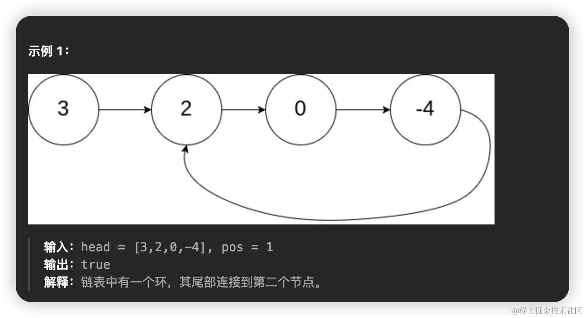
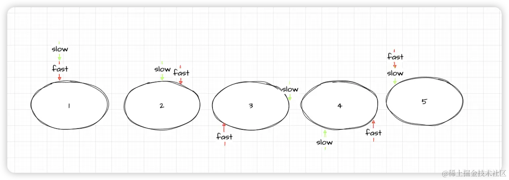

# [141. 环形链表](https://leetcode.cn/problems/linked-list-cycle/)
## 题目
给你一个链表的头节点 `head` ，判断链表中是否有环。
如果链表中有某个节点，可以通过连续跟踪 `next` 指针再次到达，则链表中存在环。 为了表示给定链表中的环，评测系统内部使用整数 `pos` 来表示链表尾连接到链表中的位置（索引从 0 开始）。**注意：`pos` 不作为参数进行传递** 。仅仅是为了标识链表的实际情况。

*如果链表中存在环* ，则返回 `true` 。 否则，返回 `false` 。



## 题解
这道题目最常见的解法就是**快慢指针**。我们经常把判断一个链表有环来比作是操场，因为操场肯定是一个环。假设有两个人在操场上跑圈，一个人跑的快一个人跑的慢。跑的快的人肯定会比跑的慢的人多跑一圈并追上跑的慢的人。
我们用图来表示一下。


slow表示跑的慢的人，fast表示跑的快的人，所以只要是在操场上跑（有环）fast就一定会比slow多跑一圈并追上他。回到我们的题目中，我们用一个慢指针，和一个快指针，慢指针每次都一步，快指针每次都两步，所以我们只需要判断快慢指针是否会相遇就可以判断这个链表是否有环了。

在链表中，每个节点只会知道它的下一个节点，所以一个节点或者没有节点是无法判断链表中是否有环的。所以我们首先需要对这个边界条件进行判断
```js
var hasCycle = function(head) {
    if (!head || !head.next) return false
};
```
如果这个链表没有环，那么fast永远都不会追上slow，直到fast指针最后会遇到null,说明链表没有环。否则fast会超过slow 一圈并与slow相遇，说明这个链表有环
```js
var hasCycle = function(head) {
    if (!head || !head.next) return false

    let fast = head, slow = head
    while (fast && fast.next) {
        fast = fast.next.next
        slow = slow.next
        if (fast === slow) {
              return true
        }
    }

  return false
};
```