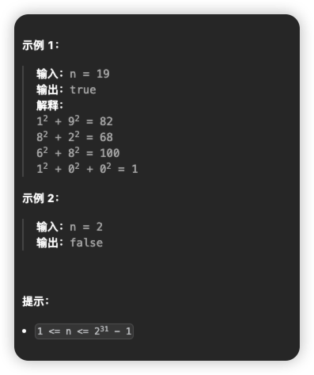
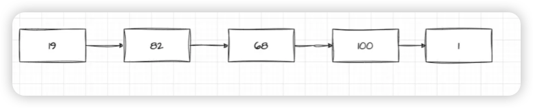
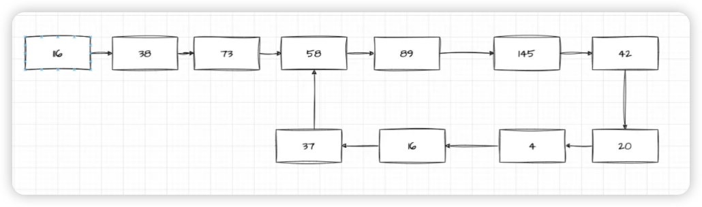

# [202. 快乐数](https://leetcode.cn/problems/happy-number/)

## 题目

编写一个算法来判断一个数  `n`  是不是快乐数。

**「快乐数」**  定义为：

- 对于一个正整数，每一次将该数替换为它每个位置上的数字的平方和。
- 然后重复这个过程直到这个数变为 1，也可能是  **无限循环**  但始终变不到 1。
- 如果这个过程  **结果为** 1，那么这个数就是快乐数。

如果  `n`  是  *快乐数*  就返回  `true` ；不是，则返回  `false` 。



## 题解

这道题我们可以转换为[判断一个链表是否有环](../easy/141.%20环形链表)

**比如：**

1. 如果遍历某个节点为 1，说明链表没环，就是快乐数
2. 如果遍历到重复的节点值，说明有环，就不是快乐数

我们用两张图来表示：
没环，是快乐数的图：


有环，不是快乐数的图：

下面我们来实现下代码：

```js
var isHappy = function (n) {
  let pre = n,
    cur = getNext(n)

  while (pre !== cur && cur !== 1) {
    pre = getNext(pre)
    cur = getNext(getNext(cur))
  }

  return cur === 1
}
```

首先我们需要定义两个快慢指针。`pre`表示慢指针，每次只走一步。`cur`表示快指针，每次走两步。这里我们提前让快指针先走一步。`getNext`表示向后走一步的方法。

我们的循环条件是要满足两个条件：

1. 快慢指针不能相当，如果相等则说明有环，那么就不是快乐数（也就是为什么上面让快指针先走一步）
2. 快指针不能为 1，如果为 1 则说明是快乐数
   最后返回的时候，只需要判断`cur`是否为 1 就可以了，如果为 1，则说明是快乐数。如果不为 1，则快慢指针相等的时候退出的循环，则说明是有环的，那就不是快乐数。

那么我们来看下`getNext`是怎么实现的。

```js
var getNext = function (n) {
  let t = 0
  while (n) {
    t += (n % 10) * (n % 10)
    n = Math.floor(n / 10)
  }
  return t
}
```

那 n = 19 来举例说明。

`t += (n % 10) * (n % 10)`, `(n % 10)`。通过`n % 10`可以找到个位数的值，也就是 9，那么`t`就是 `9 * 9`,然后通过`n = Math.floor(n / 10)`来把个位数去掉，`19/10`为 1.9，` Math.floor(1.9)`为 1， `n`就为 1，进入下一次循环，每次循环的结果`t`叠加，就可以得到我们希望的值。

## 完整代码

```js
var isHappy = function (n) {
  let pre = n,
    cur = getNext(n)

  while (pre !== cur && cur !== 1) {
    pre = getNext(pre)
    cur = getNext(getNext(cur))
  }

  return cur === 1
}

var getNext = function (n) {
  let t = 0
  while (n) {
    t += (n % 10) * (n % 10)
    n = Math.floor(n / 10)
  }

  return t
}
```
