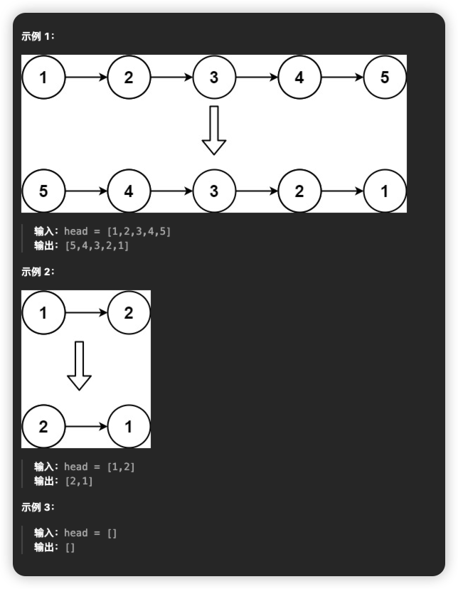
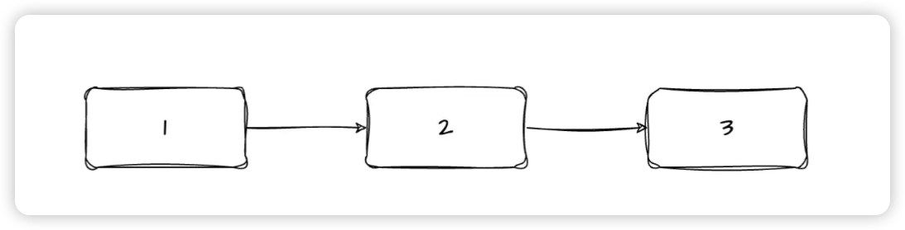
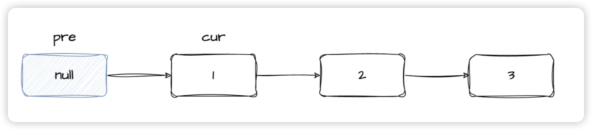
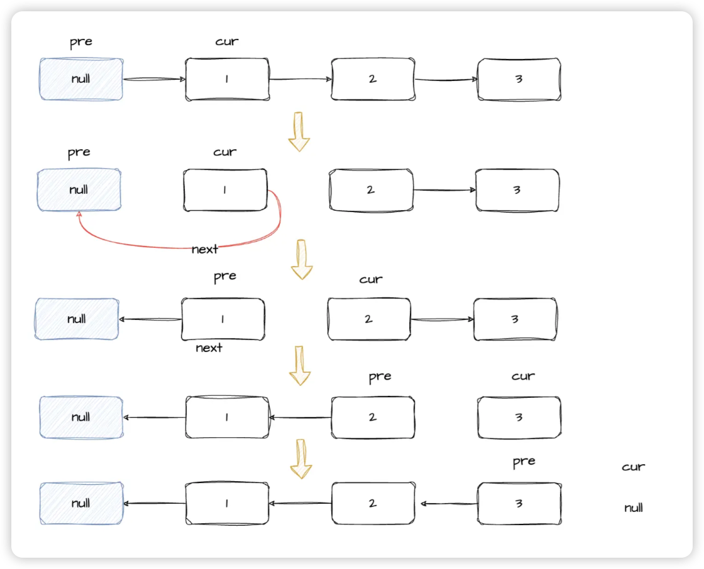

# [206. 反转链表](https://leetcode.cn/problems/reverse-linked-list/)
## 题目
给你单链表的头节点 `head` ，请你反转链表，并返回反转后的链表。


## 题解
其实这道题很好理解，我们拿一个例子表示：


比如我们需要将上图的链表进行反转，需要做的是将节点1的next指向节点1的前面的节点，但是节点1前面并没有节点，所以需要用到一个虚拟头节点（pre）.如图：



那现在就比较好操作了，定义一个虚拟头结点pre，头节点为cur，然后将cur的next节点指向pre节点，然后再将节点pre和cur往后移动一位，进行下一次反转


下面我们来看下代码：
```js
var reverseList = function(head) {
  let cur = head
  let pre = null
  while(cur !== null ) {
    let next = cur.next
    cur.next = pre
    pre = cur
    cur = next
  }

  return pre
};
```
虚拟头节点为pre，头节点为cur,每一次循环则反转一个节点。首先记录下cur的下一个节点为next,然后将cur.next指向虚拟头节点pre,然后将pre和 cur往后移动。

当cur为null的时候说明链表已经到头了，则退出循环，直接返回pre即可。

还可以用es6的解构赋值优化一下
```
var reverseList = function (head) {
  let pre = null
  let cur = head
  while (cur) {
    [cur.next, pre, cur] = [pre, cur, cur.next]
  }
  return pre
};
```