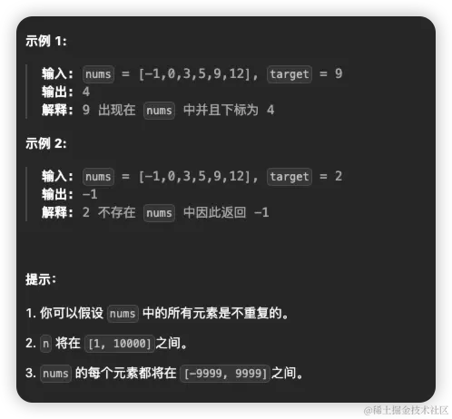
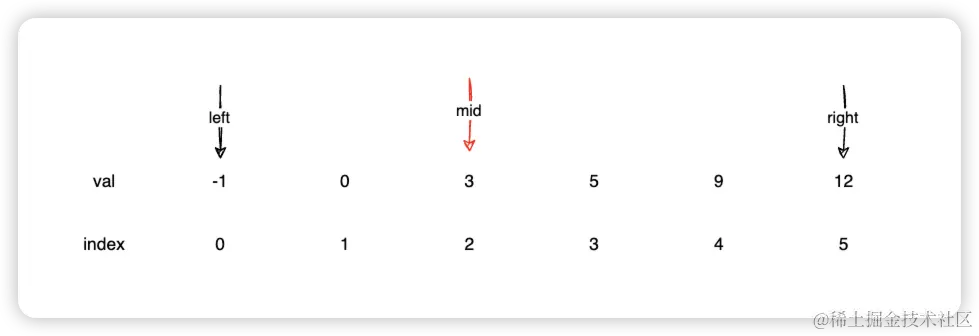
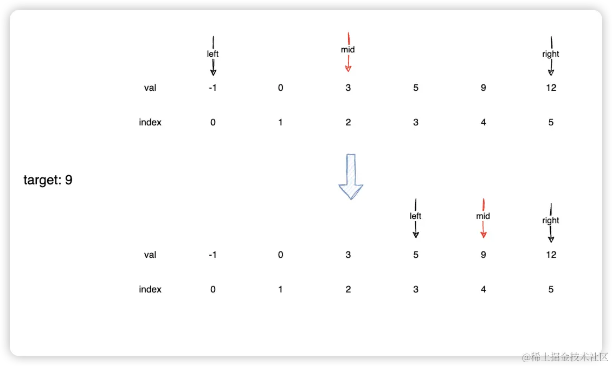
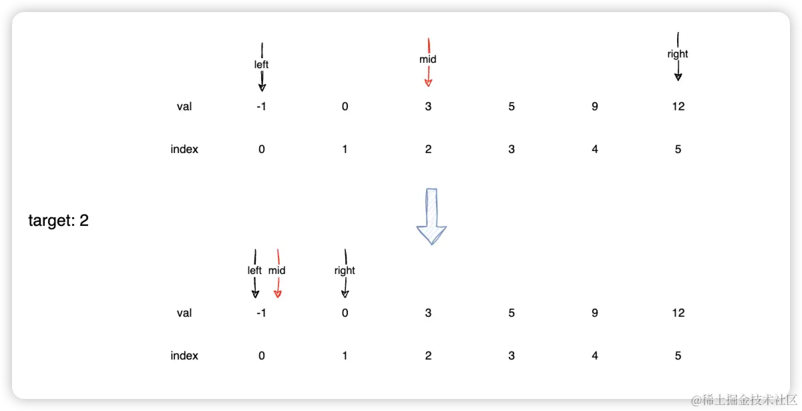
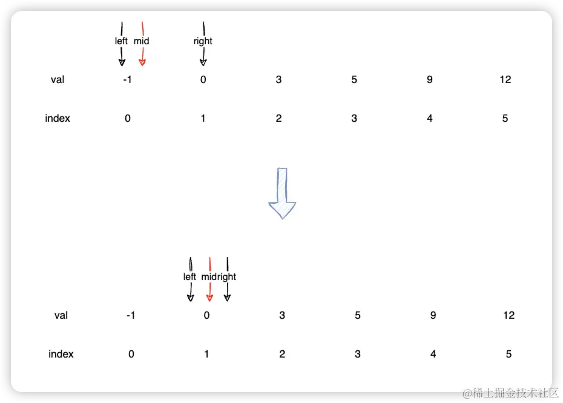

# [704. 二分查找](https://leetcode.cn/problems/binary-search/)
### 题目
给定一个 `n` 个元素有序的（升序）整型数组 `nums` 和一个目标值 `target`  ，写一个函数搜索 `nums` 中的 `target`，如果目标值存在返回下标，否则返回 `-1`。

## 题解
题目中给我们一个**排序**数组和一个目标值，然后找到这个目标值，返回对应的位置，如果没有找到则返回-1。这个我们就可以利用**二分查找**来解决那可就很简单了（不清楚二分的可以先去看看[二分查找](../common/二分查找)）。
### 示例1
我们先用图来演示下示例1
首先我们需要两个指针：一个左边指针（开始起点）`left`,也就是数组的第一个索引"0".一个右边指针（结束索引）`right`,也就是数组的最后一个索引`nums.length - 1`。同时我们还需要一个中间点`mid`.


可以发现，`mid`是处在索引为2的地方，这是为什么呢？因为`left` 和`right`的索引的一半是`2.5`没有对应的索引，所以可以通过`Math.floor`解决这个问题。然后我们在通过`mid`对应的值和`target`的值进行对比。

- 如果`mid`对应的值和`target`对应的值相等，说明找到了，则直接返回即可
- 如果`mid`对应的值小于`target`对应的值，说明`target`的值在`(mid, right]`这个区间内，则将`left`直接移动到`mid`的下一位
- 如果`mid`对应的值大于`target`对应的值，说明`target`的值在`[left, mid)`这个区间内，则将`right`直接移动到`mid`的上一位

比如我们的这个案例中，`target`是9，`mid`对应的是3,所以需要改变`left`的位置。我们通过图来看下完整的过程



当`mid`对应的值是9，和`target`一样的时候，则直接返回。

那如果没有找到呢？我们来看下示例2
### 示例2
示例2中`target`变成了2.我们再来看下图



当`mid`对应的值为3时，比`target`大，所以需要改变`right`的位置.`right`的位置确认后，我们就可以确认`mid`的位置，此时它和`left`的对应的值是一样的，比`target`小，所以需要改变`left`的位置。



根据同样的步骤走完之后，此时`left`,`right`,`mid`，在同一个位置，但是还是没有找到`target`的值，而且`mid`对应的值比`target`小，,所以需要改变`left`的位置。这样的话，`left`就大于`right`了，那就不可能找到了，则return -1

## 完整代码
```js
var search = function (nums, target) {
  let left = 0;
  let right = nums.length - 1;
  while (left <= right) {
    const mid = Math.floor(left + (right - left) / 2);
    if (nums[mid] === target) {
      return mid;
    } else if (nums[mid] > target) {
      right = mid - 1;
    } else if (nums[mid] < target) {
      left = mid + 1;
    }
  }
  return -1;
};
```