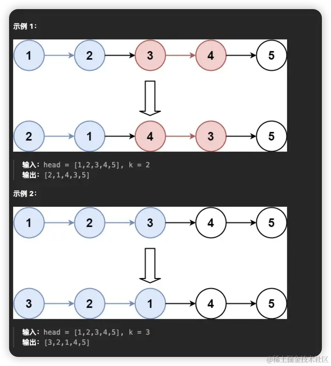
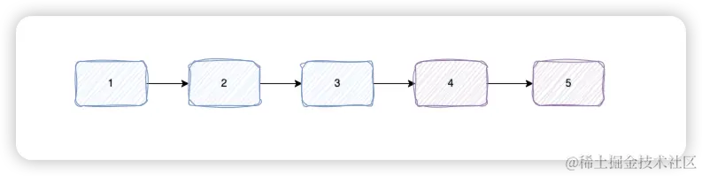
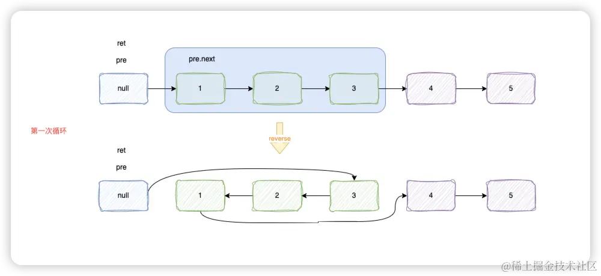
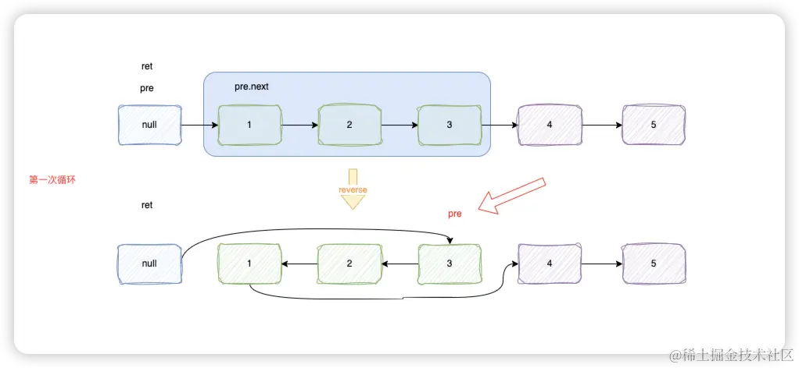

# [25. K 个一组翻转链表](https://leetcode.cn/problems/reverse-nodes-in-k-group/)
## 题目
给你链表的头节点 `head` ，每 `k`个节点一组进行翻转，请你返回修改后的链表。

`k` 是一个正整数，它的值小于或等于链表的长度。如果节点总数不是 `k` 的整数倍，那么请将最后剩余的节点保持原有顺序。

你不能只是单纯的改变节点内部的值，而是需要实际进行节点交换。


## 题解
我们首先来看下这道题想要干什么的。`K`个一组翻转链表。比如示例2，`k`为3那么就是3个节点一组翻转，那么最终的效果为前三个节点翻转，还剩两个节点不足3个，则不翻转，直接返回。

### reverse 实现一个单纯的翻转函数
我们首先来实现一个`reverse`的函数,第一个参数为`head`（需要翻转的起始点），第二个参数为`n`（需要翻转的个数）这个函数用来翻转一组链表，如果`k`为3，那么这个函数就只翻转3个节点，如果不满足3个，则直接返回原有的结构。


如果`k`为3，那么根据上图起始点传入的是1的时候，是正常可以翻转的，则需要返回翻转后的链表；如果起始点传入的是4的时候，是不可以翻转的，则直接返回之前的结构。

下面看下代码是如何实现的
```js
var reverse = function (head, n) {
  let pre = head, cur = head, con = n;
  while (--n && pre) {
    pre = pre.next
  }

  if (!pre) return head;
  pre = null
  while (con--) {
    [cur.next, pre, cur] = [pre, cur, cur.next]
  }

  head.next = cur
  return pre
}
```
前7行代码主要是为来判断链表的长度够不够翻转。如果`n`为3，那么通过`while`循环，只会循环2次，如果两次循环之后，`pre`还存在，就可以说明可以完整的翻转一组。如果不存在了，说明这一组不够翻转的，则直接返回头节点即可。

如果够翻转的，那么将`pre`直接赋值为`null`，作为虚拟头节点。这里对翻转操作不太了解的可以看下前两篇文章[206. 反转链表](../easy/206.%20反转链表),[Leetcode 刷题 92. 反转链表 II](../medium/92.%20反转链表%20II)。

### 循环翻转
我们先看下代码
```js
var reverseKGroup = function (head, k) {
  if (!head) return null
  let ret = new ListNode(null, head), pre = ret;
  do {
    pre.next = reverse(pre.next, k)
    for (let i = 0; i < k && pre; i++) {
      pre = pre.next
    }
    if (!pre) break;
  } while (1)

  return ret.next
};
```
首先定义一个虚拟头节点`ret`， 将`ret`赋值给`pre`。通过循环，每次将`pre.next`的节点传给`reverse`。这里我们用图来表示一下


此时`pre`还处在虚拟头的位置，而且第一次循环已经翻转了一组，然后通过`for`循环将`pre`移动到下一次翻转的起点。


当第二次循环翻转的时候，`reverse`函数中判定不够翻转的，直接就返回原来的结构了。然后再执行`for`循环的时候，当i为2时候，由于`pre`为`null`了,`for`循环结束，同时`do while`循环退出，最后直接返回`ret.next`即可

## 完整代码
```js
var reverseKGroup = function (head, k) {
  if (!head) return null
  let ret = new ListNode(null, head), pre = ret;
  do {
    pre.next = reverse(pre.next, k)
    for (let i = 0; i < k && pre; i++) {
      pre = pre.next
    }
    if (!pre) break;
  } while (1)

  return ret.next
};

var reverse = function (head, n) {
  let pre = head, cur = head, con = n;
  while (--n && pre) {
    pre = pre.next
  }

  if (!pre) return head;
  pre = null
  while (con--) {
    [cur.next, pre, cur] = [pre, cur, cur.next]
  }

  head.next = cur
  return pre
}
```
