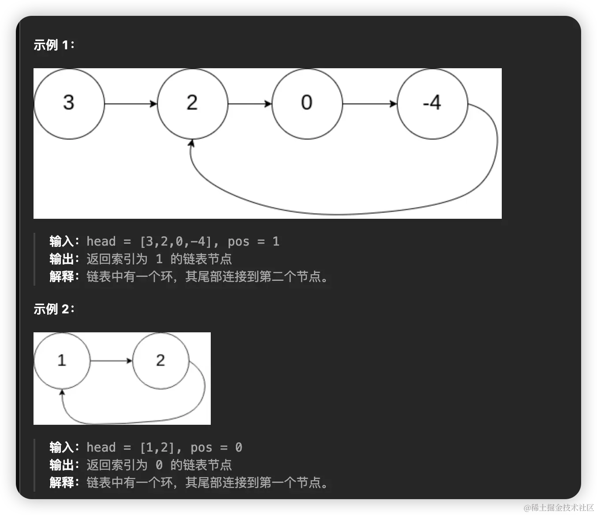
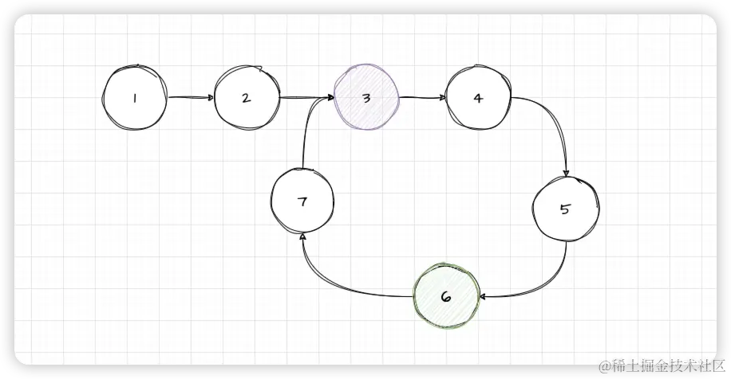
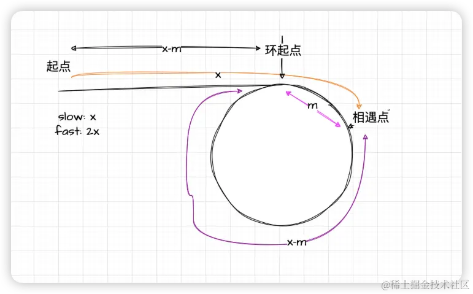

# [142. 环形链表 II](https://leetcode.cn/problems/linked-list-cycle-ii/)
## 题目
给定一个链表的头节点  `head` ，返回链表开始入环的第一个节点。 *如果链表无环，则返回 `null`。*

如果链表中有某个节点，可以通过连续跟踪 `next` 指针再次到达，则链表中存在环。 为了表示给定链表中的环，评测系统内部使用整数 `pos` 来表示链表尾连接到链表中的位置（**索引从 0 开始**）。如果 `pos` 是 `-1`，则在该链表中没有环。**注意：`pos` 不作为参数进行传递**，仅仅是为了标识链表的实际情况。

**不允许修改** 链表。


## 题解
我们简单的来概述一下这道题：如果链表有环，那么就返回这个环的起始位置。比如在实例1中，环的起始位置就是1。实例2中，环的起始位置就是0.

所以我们首先要根据上面一道题来判断链表是否有环。如果没有环则返回null
```js
var detectCycle = function (head) {
  if (!head) return null
  let slow = fast = head
  while (fast && fast.next) {
    fast = fast.next.next
    slow = slow.next
    if (fast === slow) {
      // 需要在这里面处理
    }
  }
  return null
};
```
当快慢指针相遇的时候，我们需要在此处理逻辑。


通过上面的图可以看到，快指针每次都两步，慢指针每次都一步，节点6快慢指针会相遇。我们通过观察可以发现一个现象，从相遇点节点6开始走两步，和从头节点开始走两步，刚好可以在环的连接点相遇。那么就可以找到答案了。我们先把代码实现一下，然后再来解释一下这种情况。
```js
var detectCycle = function (head) {
  if (!head) return null
  let slow = fast = head
  while (fast && fast.next) {
    fast = fast.next.next
    slow = slow.next
    if (fast === slow) {
      let cur = head
      while (cur !== slow) {
        cur = cur.next
        slow = slow.next
      }

      return cur
    }
  }
  return null
};
```
当快慢指针相遇的时候，让慢指针和头节点的指针一起走，只要他两相遇那么我们就找到了环的链接点。

下面我们来解释一下这种情况


从图中可以看到，如果slow走了x步，那么fast就走了2x，而fast比slow整整多了一圈，所以从相遇点到环起点是`x-m`, 从起点到环起点也是`x-m`，所以当fast和slow相遇的时候，我们只需要从头节点和相遇点同时出发，在`x-m`步就会相遇。