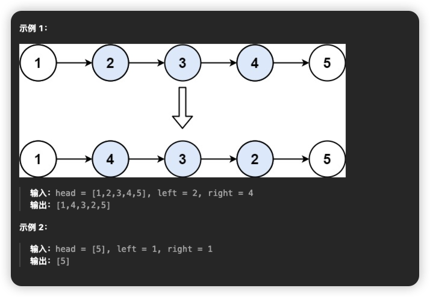
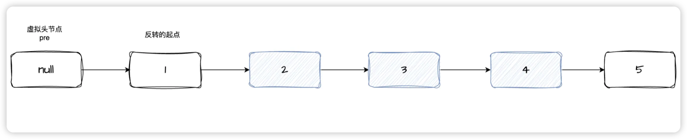
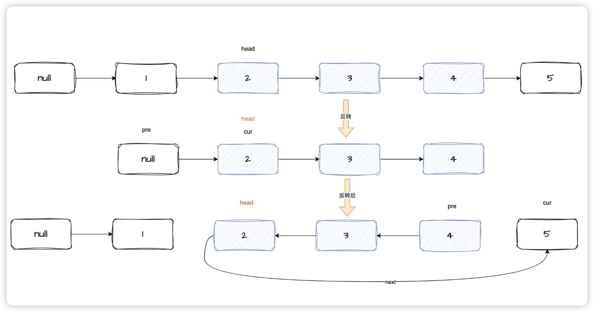
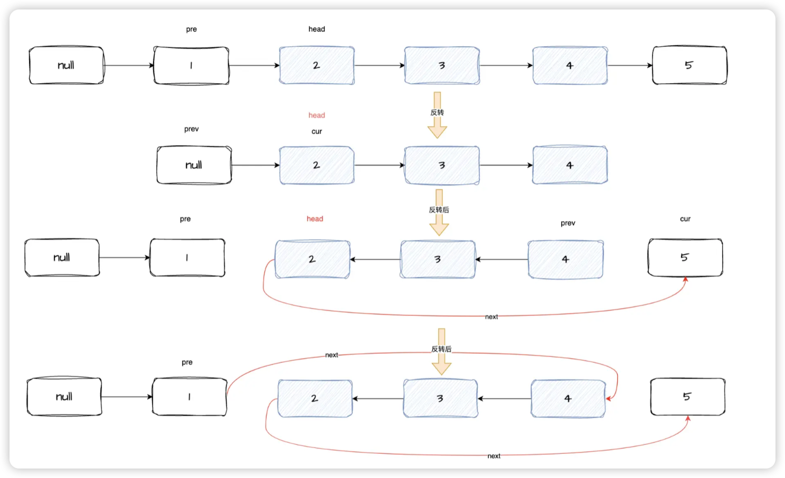

# [92. 反转链表 II](https://leetcode.cn/problems/reverse-linked-list-ii/)
## 题目
给你单链表的头指针 `head` 和两个整数 `left` 和 `right` ，其中 `left <= right` 。请你反转从位置 `left` 到位置 `right` 的链表节点，返回 **反转后的链表** 。



## 题解
我们首先来看看下这道题的意思是什么。这道题目其实很好理解，给你两个位置left和right,让你反转从位置left到位置right的链表节点。

这里还是需要一个虚拟头节点，然后我们需要计算出需要反转的个数n,以及需要反转的起点。

题目中我们就可以知道从位置 `left` 到位置 `right` 进行反转，那么需要反转的个数n就可以通过`right-left+1`计算得到。反转的起点，我们可以通过从头节点开始向后走，走到`left`的前一位就可以。下面用图来表示一下




我们看下代码：
```js
// 定义一个哨兵元素
let ret = new ListNode(null, head)
// 最后需要返回的是ret 所以需要一个变量替换
let pre = ret
// 需要反转的个数
let n = right - left + 1
// 找到反转的起点
while (--left) {
    pre = pre.next
}
```
此时的pre就是反转的起点。剩下的就需要看看怎么反转了。从上篇文章[206. 反转链表](../easy/206.%20反转链表)可以知道如何反转一个链表了。那现在反转的起点和需要反转的个数我们都已经知道，只需要对上篇文章的代码稍微修改一下就好了。
```js
var reverse = function (head, n) {
    let prev = null, cur = head
    while (n--) {
            [cur.next, prev, cur] = [prev, cur, cur.next]
    }
    // head此时已经变成了最后一个节点了， 所以他需要指向下一位，此时下一位是cur
    head.next = cur
    return prev
}
```
这里我们前6行的代码只需要将之前的循环条件改为`n--`就好了，因为需要反转n次。注意看第7行，当链表反转完毕之后，head已经是最后一个节点了，所以head的next节点需要指向下一位


如图，首先将需要反转的节点单独处理，反转完毕之后，head的节点其实已经是最后一个了，只需要将head的next指向cur就可以串联起来了。目前图中可以看到，反转后的那一段还有头需要连接


我们只需要在将pre的next节点指向反转后的节点就好了。
## 完整代码：
```js
var reverseBetween = function (head, left, right) {
    // 定义一个哨兵元素
    let ret = new ListNode(null, head)
    // 最后需要返回的是ret 所以需要一个变量替换
    let pre = ret
    // 需要反转的个数
    let n = right - left + 1
    // 找到反转的起点
    while (--left) {
        pre = pre.next
    }
    // 找到起点后开始反转
    pre.next = reverse(pre.next, n)
    return ret.next
};


var reverse = function (head, n) {
    let prev = null, cur = head
    while (n--) {
        [cur.next, prev, cur] = [prev, cur, cur.next]
    }
    // head此时已经变成了最后一个节点了， 所以他需要指向下一位，此时下一位是cur
    head.next = cur
    return prev
}
```